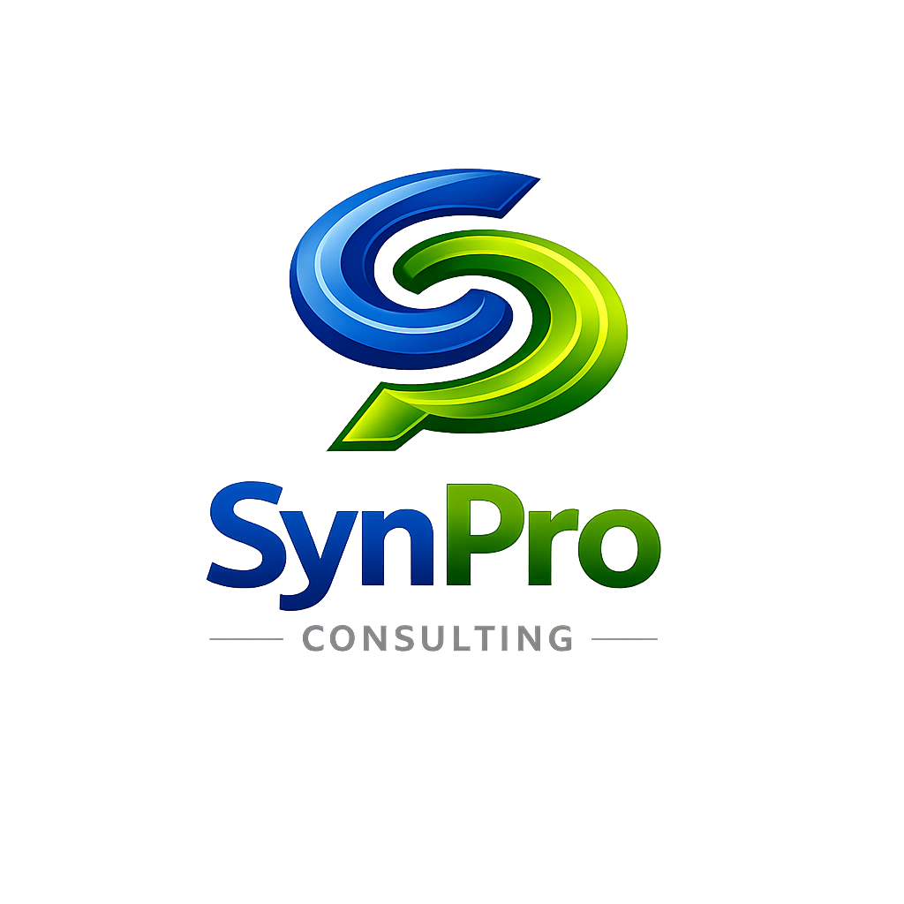

# PROJECT_CONTEXT.md — SynPro Consulting Website

> Deep implementation reference. `CLAUDE.md` holds the rules and current state; this file holds
> the detail a session needs to change something without breaking it.
>
> Updated in the **same PR** as the change it describes. Sections are numbered and stable — do
> not renumber them, as prompts reference them by number.

---

## Table of Contents

1. Endpoints
2. Content Model
3. Component & Page Structure
4. CI/CD Logic
5. Error Handling Patterns
6. Architectural Decisions
7. Design Standards
8. Appendix — Environment & DNS

---

## 1. Endpoints

The site is static. Exactly one endpoint exists.

### `POST` contact form — Cloudflare Worker

*Not yet implemented. This section is filled in by the sprint that builds it.*

Required detail once built: URL, request schema (name, company, message, enquiry type),
validation rules, response shapes for success / validation failure / rate limit / spam rejection,
CORS allowlist, rate limit key and window, honeypot mechanism, and what is logged versus what is
returned to the visitor (see AD-8 in `CLAUDE.md`).

---

## 2. Content Model

*Established in Sprint 5 (SWEB-19). Implemented in `src/content.config.ts` — that file is the
executable copy of this section. If the two disagree, the config is what ships; fix the doc.*

**D7: page copy lives in Markdown under `src/content/` so text can be edited without touching a
component.** Changing a sentence is a content edit, not a code change.

### Three collections, because the content is genuinely three shapes

| Collection | Entries | What it is |
|---|---|---|
| `pages` | 5 — `home`, `services`, `approach`, `about`, `contact` | One per route. Shared metadata plus the blocks that page needs. |
| `practices` | 2 — `facilities-services`, `workplace-maintenance-technology` | The two Services practice areas. Grouping and order. |
| `offerings` | 6 — `1-strategic-sourcing` … `6-deployment-assessment` | The six Services offerings. Repeating structure, so it is data. |

The schema was derived from the five approved drafts, not imposed on them. Services alone carries
two practices, six offerings, per-offering deliverables lists and a who-it's-for line; flattening
that into `pages` would have meant six near-identical frontmatter blocks in one file.

### Where prose lives — the one rule to know before editing

| | Use for | Rendered how |
|---|---|---|
| **Markdown body** | Continuous prose needing inline formatting — italics, bold, links | Through Astro's Markdown pipeline |
| **Frontmatter** | Short discrete strings, and structured or specification data | **As plain text — Markdown syntax will NOT render** |

Every frontmatter field was checked against the drafts: none of this sprint's frontmatter copy
needs inline formatting. The prose that does — the journal title on About, the italicised *why* on
Services — lives in a body. **If you add emphasis to a frontmatter string it will render as literal
asterisks.** Move that prose to the body instead.

### Schema

`pages` — `seoTitle`, `seoDescription`, `title` (the H1), optional `intro[]`, optional `cta`
(`heading?`, `body`, `label`). Then optional per-page blocks: `hero`, `credibility[]`,
`practicesIntro`, `practiceCards[]`, `sections[]` (Home); `independence` (Services); `form`,
`email`, `linkedin` (Contact).

`practices` — `name`, `order`. Body is the practice intro (only practice two has one).

`offerings` — `title`, `order`, `practice` (a `reference('practices')`), `deliverables[]`,
`whoFor`, optional `note`. Body is the description prose.

### The Contact `form` block is a specification, not just copy

`src/content/pages/contact.md` holds the four permitted `enquiryTypes`, the `submitLabel`, the
`messages.success` / `messages.failure` pair, all six `validation` strings, and
`messageMaxLength`. **The Cloudflare Worker built in a later sprint validates against exactly these
values**, so changing a string here changes the contract with that Worker. The success/failure pair
must stay shape-identical under AD-8.

> `messageMaxLength` is **4000, drafted not owner-approved**. The draft asked for "something
> generous" and specified no number. Confirm it in the Worker ticket.

> The success message is recorded here but **does not appear in the built page** — nothing can
> succeed while there is no endpoint. That is expected, not a missing string.

### Draft apparatus is excluded from render

The copy drafts in `Documentation\` carry ⚠ markers (flagging Claude-invented rather than
sourced material) and a "Notes for the owner" section. Both are apparatus for the owner and are
**not transcribed** into `src/content/`. The build is grepped for both at every sprint closeout.

> **Pointer (SWEB-12).** The Sprint 3 tickets document asked for the `build.inlineStylesheets`
> decision to be recorded "in §2". That was a mis-reference — §2 is the content model, and build
> configuration belongs with the rest of the build in **§4, "Stylesheet emission"**. The sections
> are deliberately stable and are referenced by number from prompts, so §4 was written rather
> than the numbering changed. Look there.

> **Pointer (SWEB-12).** The Sprint 3 tickets document asked for the `build.inlineStylesheets`
> decision to be recorded "in §2". That was a mis-reference — §2 is the content model, and build
> configuration belongs with the rest of the build in **§4, "Stylesheet emission"**. The sections
> are deliberately stable and are referenced by number from prompts, so §4 was written rather
> than the numbering changed. Look there.

---

## 3. Component & Page Structure

### Page inventory

| Route | File | Purpose |
|---|---|---|
| `/` | `src/pages/index.astro` | The placeholder page — logo, tagline, divider, "coming soon", footer |

There is exactly one route. `src/components/` exists but is empty (`.gitkeep`).

### `src/layouts/BaseLayout.astro`

The shared page shell. Owns `<html lang>`, the entire `<head>`, and `<body>`, exposing a single
default `<slot />` for page content.

| Prop | Type | Purpose |
|---|---|---|
| `title` | `string` | `<title>` text |
| `description` | `string` | `<meta name="description">` content |

It owns the head: charset, viewport, title, description, canonical link, the icon links, the Open
Graph and Twitter card meta, and the font preload. It also exposes a named `<slot name="head" />`
so a page can add its own head content without the layout growing a prop per tag.

**Styling moved out of this file in Sprint 3 (SWEB-13).** It no longer carries a `<style>` block.
Instead it imports, in this order — which is the cascade order and matters:

```js
import '../styles/tokens.css'; // custom properties only, no rules
import '../styles/fonts.css'; // the single @font-face for self-hosted Sora
import '../styles/global.css'; // reset, base, focus, placeholder rules
```

**These are plain `.css` imports, not scoped `<style>` blocks, and that is load-bearing for the
same reason `is:global` was.** The rules target `html`, `body`, `*`, and `@keyframes`; Astro's
component scoping rewrites selectors with a hash attribute, which would leave the universal reset
and the body background applying to nothing. Imported stylesheets are never scoped, so the problem
is now structural rather than dependent on remembering a directive. Do not move these rules back
into a component `<style>` block without `is:global`.

`build.inlineStylesheets: 'always'` then inlines the bundled result into the page — see §4.

**No Google Fonts request remains.** The `<link>` to the font CDN and its two preconnects were
removed; Sora is served from `public/fonts/`. A `rel="preload"` for the one variable font file
replaces them, keeping it off the critical path without a cross-origin round trip.

### `src/pages/index.astro`

Renders through `BaseLayout` and reproduces the pre-Sprint-1 placeholder exactly: the two `.aura`
gradient blobs, `main.stage` with the logo, tagline, divider, and status line, and the footer with
the JS-populated copyright year.

One detail is deliberate and easy to "fix" wrongly:

- **The year script carries `is:inline`.** Without it Astro bundles the script and hoists it into
  `<head>` as a module. `is:inline` keeps it in place and unprocessed, matching the original.

### `src/layouts/PageLayout.astro` *(SWEB-19)*

The shell every content page uses. It **complements** `BaseLayout` rather than replacing it:
`BaseLayout` still owns `<head>` — canonical URL, Open Graph, icons, font preload — so metadata
stays in one place. `PageLayout` adds the visible shell: skip link, header, `<main id="main">`,
footer.

`src/styles/pages.css` is imported **here and nowhere else**. `index.astro` does not use
`PageLayout`, so none of it reaches the placeholder's CSS bundle and the front page stays
byte-identical. That separation is the reason it is a fourth stylesheet rather than an addition to
`global.css`.

**There is deliberately no navigation.** Nav is cutover-PR scope (AD-10). The footer carries the
copyright line and the LinkedIn link, and nothing else links between pages — with one exception
noted below.

#### `BaseLayout` gained one prop, and it is output-neutral

`bodyClass?: string`, rendered as `<body class={bodyClass}>`. `PageLayout` passes `"page"`.
`index.astro` passes nothing, and **Astro omits the attribute entirely when a class is
undefined**, so the placeholder's markup and CSS bundle are both unchanged — verified by
byte-identical output.

#### Two placeholder rules leak onto content pages, and both are neutralised

`global.css` styles the bare `body` and `footer` **type selectors** for the placeholder. A class
selector only wins for the properties it actually declares, so the rest leak into any page:

- `body` — flex-centred, `text-align: center`, `height: 100%`, **`overflow: hidden`**. On a
  scrolling page that last one alone makes the content unreachable.
- `footer` — **`position: fixed`**, `bottom`, uppercased, and an entrance animation on a 1.2s
  delay. Left alone, the site footer never appears in the document flow at all.

Both are reset in `pages.css` at `body.page` and `body.page > footer`. **Expect this block to
disappear at cutover**, when the placeholder and its `--ph-*` rules go. Do not "tidy" it away
before then.

> A related trap, found and fixed in the same sprint: an earlier `body.page > *` rule also matched
> the skip link and overrode its `position: absolute`, rendering it permanently visible at the top
> of every page instead of only on focus. The shell elements are now named individually.

### The routes built in Sprint 5

| Route | Source | Notes |
|---|---|---|
| `/services` | `pages/services` + `practices` + `offerings` | Practices banded with an accent rule; independence disclosure given the strongest treatment on the page |
| `/approach` | `pages/approach` | All prose, rendered through `.prose` |
| `/about` | `pages/about` | Portrait, pre-cropped at build time |
| `/contact` | `pages/contact` | Form UI only — see §2 and the note below |
| `/home-preview` | `pages/home` | **The real Home page at a temporary route.** `/` is still the placeholder |
| `/404` | `404.astro` | Copy drafted, not owner-approved |

**`/home-preview` becomes `/` in the cutover PR, not before.** Promoting it early publishes a
half-built site under the company's own name, which is what AD-10 exists to prevent.

**The 404's link to `/contact` is the only inter-page link on the site.** It exists because SWEB-24
requires the 404 to offer a route back, and `/` is still the placeholder. Revisit at cutover.

#### The portrait was processed at build time, not by CSS

`Johan_Wessels2.jpg` measures **2073×2441** — the ticket recorded 1008×1204, which was wrong
(Sprint 3 lesson 5: measure the asset). Landmarks were measured from the source — hair top y=183,
eye line y=830, chin y=1379, head centre x=1080 — and a 2000px square was cropped at x=73, y=0,
putting the eye line at 41.5% from the top with ~9% headroom.

The source sits on flat light grey. A circular crop alone would put a bright disc on a near-black
page, and cutting the subject out would fringe. Instead **the rim is faded to `--surface-base` over
the outer 14% of the radius and composited onto that same colour**, so the corner pixels equal the
page background exactly and no seam is possible. Served as WebP with a JPEG fallback at 384px for a
192px render.

`public/mark-spiral.png` was cropped from `logo.png` the same way: the lockup is stacked — spiral
over "SynPro" over "CONSULTING" — and at header size all three collapse into mush, the trap SWEB-14
hit with the favicon. The header uses the spiral alone with the wordmark set in type beside it.

### Asset path convention — root-absolute, always *(settled SWEB-17)*

**Every reference to a file in `public/` starts with `/`.** This is the rule for every page built
from here on, not a preference. **Applied to every page added in Sprint 5** — the portrait, the
spiral mark, and the shell's assets are all root-absolute:

```html
           <!-- correct -->
            <!-- wrong: resolves against the current route -->
```

A relative reference resolves against the *current route*, so `logo.png` on a `/services/` page
requests `/services/logo.png` and 404s. The site is served at the apex, so the leading `/` always
points at the `public/` root. Every reference now follows it — `/logo.png`, `/favicon.ico`,
`/apple-touch-icon.png`, `/fonts/sora-latin-var.woff2` in both the preload and the `@font-face`.

`canonical` and `og:image` are the one deliberate exception and are not relative-vs-absolute at
all: they are built as **fully-qualified URLs** with `new URL(..., Astro.site)`, because Open Graph
scrapers do not resolve site-relative paths.

> **History, so the reversal is not re-litigated.** Until SWEB-17 `logo.png` alone was relative,
> justified on the grounds that `/logo.png` would 404 on the `github.io` origin URL that the Hard
> Rules told you to verify against. That justification was void: the origin **301-redirects to the
> apex**, so root-absolute resolves there too, and the Hard Rule itself was replaced in the same
> sprint (**AD-11**). One dead rule was propping up one inconsistent reference.

---

## 4. CI/CD Logic

### Trigger

`push` to `feature/**`, `fix/**`, `docs/**`, and `main`, plus `workflow_dispatch`. There is no
`pull_request` trigger — the auto-merger resolves the PR from the branch name, exactly as on
Fracttal PRM. `workflow_dispatch` was added so the owner can re-run the deploy by hand after
switching the Pages source without pushing an empty commit.

Top-level `permissions: contents: read`. Only the `deploy` job widens this, for itself.
`NODE_VERSION` is set once as a workflow-level `env` so the three Node jobs cannot drift apart.

### Job summary

| Job | Trigger condition | Blocking | What it does |
|---|---|---|---|
| `build` | every run | **Yes** | `npm ci` → `npm run build` → asserts `dist/CNAME` → uploads `dist/` artifact |
| `format` | every run | **Yes** | `npm ci` → `npm run format:check` |
| `links` | every run, `needs: build` | **Yes** | downloads the `dist` artifact → `npm run links` |
| `deploy` | `github.ref == 'refs/heads/main'`, `needs: build` | No (`continue-on-error`) | `configure-pages` → `upload-pages-artifact` → `deploy-pages` |
| `auto-merge` | `github.ref != 'refs/heads/main'`, `needs: [build, format, links]` | n/a | squash-merges the open PR for the branch |

**The blocking list is the `needs:` array on `auto-merge`.** It is not a separately configured
check-name list, so it cannot silently drift; but renaming a job id without updating that array
breaks the gate in one of the two classic ways (merges on nothing / blocks forever).

`links` intentionally consumes the artifact rather than rebuilding. It therefore checks the exact
bytes that `deploy` would publish, and cannot pass against a different build than the one shipped.

### The `dist/CNAME` assertion (AD-9)

The `build` job fails if `dist/CNAME` is absent, or if its whitespace-stripped contents are not
exactly `synproconsulting.co`. This is the enforcement point for AD-9 — the invariant that would
otherwise fail silently and take the live domain down. It runs after `npm run build` and before
the artifact upload, so a bad artifact is never produced.

`public/CNAME` is 19 bytes with **no trailing newline** and is now the only copy in the repo — the
root duplicate was deleted in Sprint 2 (SWEB-9) after both were confirmed to share blob SHA
`b35b949d`. The assertion strips whitespace, so a trailing newline would not fail it.

### Link checking

`linkinator@8.0.3`, pinned exactly, configured by `.linkinatorrc.json` rather than CLI flags.

The config file is not a style choice. linkinator serves the target directory over
**`127.0.0.1`**, so internal links become absolute `http://` URLs during the crawl. A skip pattern
of `^https?://` therefore skips the crawl root and the checker passes having scanned **zero
links** — green and completely inert. The working pattern excludes the loopback hosts explicitly:

```
^https?://(?!(localhost|127\.0\.0\.1|\[::1\]))
```

Passing that regex as a CLI flag was also mangled by Windows shell quoting, which is the second
reason it lives in a config file. See `RUNBOOK.md` §8 for the positive and negative tests that
prove the check is live.

### Stylesheet emission — `build.inlineStylesheets` *(SWEB-12)*

Set explicitly to **`'always'`** in `astro.config.mjs`.

**The problem it solves.** The Astro default is `'auto'`, which inlines a stylesheet only while it
stays under roughly 4 kB and emits a separate `.css` file above that. Output *structure* therefore
depended on stylesheet *size*, and the boundary was close enough to trip. In Sprint 2 the same
commit built two different ways: CI produced a 5102-byte page with the CSS inlined and 2 crawlable
links, while the Windows working copy produced a 1093-byte page, a separate
`_astro/index.*.css`, and 3 links — purely because CRLF line endings added 203 bytes and pushed the
compiled stylesheet from 4013 to 4216 bytes. That divergence is what produced the SWEB-11 defect.

`.gitattributes` (below) removes the line-ending half. This setting removes the other half: emission
is now decided by configuration, not by whichever side of 4096 bytes the stylesheet happens to land
on. That mattered immediately, because SWEB-13 grew the stylesheet well past 4 kB — under `'auto'`
the flip would have happened silently inside the same PR that also rewrote the CSS, leaving no way
to attribute a diff to either change.

**Why `'always'` and not `'never'`.** `'always'` reproduces what production was already serving,
which is what allowed SWEB-12 to prove itself inert: local output became byte-identical to the live
page (5102 bytes, matching SHA-256) with no CSS content change.

**Trade-off, recorded now rather than discovered later.** Inlining costs cross-page caching. With a
single route that is free. Once a second route exists, the shared token stylesheet is duplicated
into every page instead of being fetched once and cached, and `'never'` becomes the better choice.
**Revisit when the second route lands.**

### Line endings — `.gitattributes` *(SWEB-12)*

`* text=auto eol=lf`, plus explicit `binary` for images, fonts, and archives.

The repository has always stored LF and CI has always checked out LF; only the Windows working copy
differed, under `core.autocrlf=true`. That is normally cosmetic — here it changed build output
shape, as above. `.gitattributes` is repo-scoped and travels with the project, which a local
`core.autocrlf` setting does not, so it protects the next machine and the next contributor too.

Applying it required re-checking-out the tracked files, not just `git add --renormalize` —
renormalising updates the index while leaving the working copy untouched. After re-checkout,
`BaseLayout.astro` went from 5279 bytes with 203 CRLF pairs to 5076 bytes with none, matching the
blob exactly. The binary patterns are belt-and-braces: Git's auto-detection normally gets images
right, but a corrupted logo is an expensive way to discover an edge case.

### CSS minification — `vite.build.cssMinify` *(decided SWEB-16)*

Set to **`'esbuild'`**. Not `true`, and never `'lightningcss'`.

**The trap.** `true` is not a neutral "on": it selects Astro 7.2.0's default CSS minifier, which is
Lightning CSS. Lightning CSS **1.33.0** drops `-webkit-background-clip: text` while keeping
`-webkit-text-fill-color: transparent`. On an engine that still needs the prefix for
`background-clip: text`, nothing clips the gradient but the fill stays transparent, so
`.status .soon` renders as a solid gradient bar with the words gone. This is the Sprint 1 defect
that produced `cssMinify: false`, and Sprint 4 **re-ran the test rather than trusting the note** —
it still reproduces.

**Measured on the placeholder, 2026-08-08** (inlined CSS, `<style>` contents only):

| `cssMinify` | Inlined CSS | Page | `-webkit-background-clip` | Renders |
|---|---|---|---|---|
| `false` (previous) | 16,017 B | 18,705 B | kept | correct |
| **`'esbuild'` (current)** | **5,895 B** | **8,805 B** | **kept** | **correct** |
| `true` / `'lightningcss'` | 5,724 B | 8,412 B | **stripped** | **text invisible** |

Lightning CSS saves 171 bytes more than esbuild and costs the text. esbuild takes 63.2 % off the
stylesheet with the pairing intact.

**Why the visual test alone could not decide this.** Chrome supports *unprefixed*
`background-clip: text`, so the Lightning CSS build screenshots **byte-identical** to the baseline
in Chrome — all four viewports, matching SHA-256. A screenshot-only check would have cleared a
broken build. The defect was demonstrated by simulating an affected engine: remove only the
unprefixed declaration from the built page — exactly what such an engine does with a property it
does not recognise — and re-screenshot. Under that engine the Lightning CSS build loses the words
while the esbuild and unminified builds are unchanged from baseline. **Source inspection and
render inspection are both required here; neither alone is sufficient.**

**Enforced, not remembered.** The `build` job fails if `dist/` ever carries
`-webkit-text-fill-color` without a matching `-webkit-background-clip`. Negative-tested against a
real `cssMinify: 'lightningcss'` build, which the guard rejects, and positively against the shipped
build, which it passes. Setting `cssMinify: true` now fails CI instead of shipping silently — the
AD-46 pattern (a control that is green and inert) is what this guard exists to avoid.

**Revisit condition — falsifiable, unlike its predecessor.** The old condition was "if the CSS
pipeline changes", which is unfalsifiable and was already met without anyone noticing. The
condition now is: **when a Lightning CSS release emits `-webkit-background-clip` alongside the
unprefixed property.** Test it by building with `cssMinify: 'lightningcss'` and grepping `dist/`
for both declarations; if both appear, Lightning CSS becomes usable again.

### Deploy

GitHub Pages, published from the `dist` artifact on `main` only.

**This job is live and serves production.** Sprint 1 predicted it would fail until a manual Pages
source switch; that prediction was wrong (SWEB-6). `actions/configure-pages@v6` published on the
first merge, and `synproconsulting.co` has served the build artifact since — verified by fetching
the live HTML and finding it byte-equal to local `dist/index.html`.

**The stored Pages setting now matches.** The owner set Settings → Pages → Source to "GitHub
Actions" after Sprint 1 closed. Observed 2026-08-07: `GET /repos/.../pages` reports
`build_type: workflow`, `cname: synproconsulting.co`, `status: built`, `https_enforced: true`.

**Durable lesson — `build_type` is not a reliable indicator of the active deploy path.** This
outlived the condition that produced it and is the reason the check below is written down rather
than inferred. Through Sprint 1 the API reported `build_type: legacy` / `source: main/` while the
Actions artifact was demonstrably what visitors received. The field describes the *stored setting*,
not the live delivery path, and the two can disagree in either direction. To determine which path
is serving, fetch the live HTML and compare it against the build output — see `RUNBOOK.md` §3 for
the exact comparison. Do not answer the question from `build_type` alone.

The job stays `continue-on-error: true` so it can never block the auto-merger (AD-6) — which per
AD-6's own consequence note means it can also fail unnoticed. Check it at every closeout.

### Auto-merger

Ported from `synproconsulting/Fracttal-PRM` `.github/workflows/ci.yml`. Adaptations made:

| Change | Reason |
|---|---|
| `needs: test` → `needs: [build, format, links]` | This repo's blocking jobs |
| Added a guard that fails loudly if `secrets.PAT_TOKEN` is empty | The secret was absent on this repo at Sprint 1; an unset token otherwise surfaces as an opaque 401 |
| Job ids given matching `name:` values | So the GitHub check name and the `needs:` id are the same string, removing any ambiguity about what "the check name" is |

Preserved unchanged: the `{sha: $GITHUB_SHA}` merge guard from FPRM-36, which makes GitHub refuse
the merge with 409 if the PR head advanced past the commit this run actually tested, and the
`exit 0` on 409 (the newer commit triggers its own run).

`PAT_TOKEN` must be a classic PAT with `repo` + `workflow` scope. The built-in `GITHUB_TOKEN`
cannot substitute for it: pushes made with `GITHUB_TOKEN` do not trigger further workflow runs, so
the merge to `main` would never fire the `deploy` job.

---

## 5. Error Handling Patterns

*Populated when the Worker is built.*

The governing principle is AD-8: the visitor-facing response never reveals delivery state or
upstream provider detail. Record the exact response bodies and status codes here so future
changes stay consistent.

---

## 6. Architectural Decisions

Full text for each AD summarised in `CLAUDE.md`. Each entry uses the four-part form below.

### AD-1 · Static site, single dynamic surface

**Decision.** The site is statically generated and CDN-served. Exactly one dynamic capability
exists: the contact form.

**Why.** A brochure site with a contact form does not need a runtime. Every dynamic surface added
is a permanent security, cost, and maintenance obligation on a property that otherwise has none.

**Consequence.** No database, no auth, no sessions. Anything requiring server state is a scope
decision, not an implementation detail.

**Do not.** Add a second dynamic endpoint without explicit scope confirmation from the owner.

### AD-2 · All GitHub operations use the REST API — no git CLI for repo mutations

*Inherited from Fracttal PRM AD-2.*

**Decision.** Branches, commits, trees, and PRs are created via the GitHub Contents and Git Trees
APIs. The local git CLI is used only for pre-flight and post-flight working-tree sync.

**Why.** Removes dependence on local git state and credential configuration for the operations
that matter.

**Consequence.** The local working tree is a read surface, not the source of truth. It must be
hard-reset at both ends of every session.

**Do not.** Push branches from the CLI — the working tree and `origin` will silently diverge.

### AD-3 · Feature branches are always recreated from `main`, never updated in place

*Inherited from Fracttal PRM AD-3.*

**Decision.** Delete any existing branch of the same name, then recreate from the latest `main`
SHA.

**Why.** Guarantees a clean diff and prevents a stale branch carrying unrelated commits.

**Do not.** Rebase or merge `main` into a feature branch — recreate it.

### AD-4 · Jira sprints tracked via fix versions, not native Agile sprints

*Inherited from Fracttal PRM AD-4 — verified against FPRM `PROJECT_CONTEXT.md` §6.*

**Decision.** Tickets are assigned to sprints using Jira's `fixVersions` field. Sprint IDs map to
Jira versions pre-created before each sprint. The fix version is the tracking mechanism; the
native Agile sprint is not.

**Why.** Fix versions are simpler to create and query programmatically and do not require board
access configuration.

**Consequence.** A dual JQL query is always needed — `fixVersion = {fix_id} OR sprint = {native_id}`
— because neither field alone is reliable. Always pre-create the fix version manually and verify it
before sprint setup.

**Do not.** Query on one field only — tickets will be missed at closeout. Do not read the dual
query as evidence that the two fields are co-equal tracking mechanisms: it is a defensive
consequence of the fix-version decision, not a second mechanism.

> **SWEB practice note.** Sprint 1 populated *both* `fixVersions` and the native sprint field
> (`customfield_10020`) on every Story, because board 100 is a Scrum board and the sprint field is
> what makes tickets appear on it. That is compatible with this AD — the fix version remains the
> authoritative grouping, and setting the sprint as well is what makes the dual query resolve.

### AD-5 · Sub-tasks inherit fix version and sprint from their parent

*Inherited from Fracttal PRM AD-10.*

**Decision.** Never set fix version or sprint on a Sub-task issue directly.

**Why.** Jira returns HTTP 400. The dual-query surfaces subtasks via parent membership anyway.

### AD-6 · Non-blocking CI jobs run with `continue-on-error: true`

*Inherited from Fracttal PRM AD-7.*

**Decision.** Advisory jobs never gate the auto-merger.

**Why.** A quality signal that can block a merge becomes a quality signal that gets disabled.

**Consequence.** An advisory job can fail indefinitely without anyone noticing — on Fracttal PRM,
the SonarCloud scan fails on every CI run and is carried as known technical debt. Review advisory
job health at each sprint closeout, or don't add the job.

### AD-7 · Email delivery is Resend over HTTPS; SMTP is never used

*Inherited from Fracttal PRM AD-47.*

**Decision.** The Worker calls `POST https://api.resend.com/emails` with a Bearer API key. Sender
domain `contact.synproconsulting.co` (already verified); destination `info@synproconsulting.co`.

**Why.** The domain is verified and in use; SMTP was proven permanently blocked on the sibling
projects' host and is a dead path generally for this pattern.

**Do not.** Introduce an SMTP client or `SMTP_*` configuration in any form.

### AD-8 · The form endpoint never reveals delivery state

*Adapted from Fracttal PRM AD-13.*

**Decision.** Transport failures are logged server-side and returned to the visitor as a generic
failure. Success, rate-limit, and spam-rejection responses are indistinguishable in shape.

**Why.** An enquiry form is an unauthenticated public endpoint. Differentiated responses give an
abuser a working oracle for tuning around the controls.

**Do not.** Return an upstream status code, provider error, or "message flagged as spam" text.

### AD-9 · `CNAME` is a build artifact, not a repo-root file

**Decision.** `CNAME` lives in the static passthrough directory (`public/`) and is published with
every build.

**Why.** GitHub Pages reads the custom domain from the published artifact. Under an
Actions-based deploy the artifact is the build output, not the repo root.

**Consequence.** If `CNAME` is missing from a build, the custom domain silently unconfigures and
the live site goes down.

**Do not.** Delete it, move it, or add it to `.gitignore`.

### AD-10 · The site is crawler-locked until the cutover PR

**Decision.** `public/robots.txt` disallows all user agents from all paths for the entire duration
of the build programme. It lives in `public/` so the Astro static passthrough copies it verbatim
into `dist/` on every build, exactly as `CNAME` is handled under AD-9. The lockout is lifted
**only** in the cutover PR — in the same commit that publishes the nav and the real Home page.

**Why.** The owner has confirmed a build-everything-then-cut-over-once strategy: pages are built
and merged across several sprints, but the navigation and real Home page go live in one later PR.
Because `main` is production, every page merged before that cutover is publicly fetchable at its
route the moment it merges, whether or not anything links to it. **Unlinked is not private** —
crawlers find routes through means other than in-site links, and this repository is public, so the
routes are readable in source regardless. Without the lockout, half-built pages are indexable under
the company's own name.

**Consequence.** Nothing on the site is indexable until the cutover, which is the intended state,
but it makes the cutover PR carry two responsibilities rather than one: publish the nav and Home
page, *and* lift the lockout. Shipping the cutover without lifting it leaves a finished site that
no search engine will index — a silent failure with no visible symptom on the page itself. This is
scaffolding with a defined removal point, not a permanent setting.

**Do not.** Add `@astrojs/sitemap` or any sitemap generation while the lockout is in place — a
sitemap advertising disallowed routes is contradictory and defeats the purpose. Do not substitute
a `noindex` meta tag: it asks a crawler not to *index* a page it has already *fetched*, and the
concern here is fetching. Do not treat the file as permanent, and do not lift it in an earlier PR
"to get it out of the way".

### AD-11 · Deploy safety is detection-and-rollback, not origin-URL prevention

**Decision.** The Hard Rule requiring a risky change to be verified on
`https://synproconsulting.github.io/synpro-website/` **before** the custom domain follows is
withdrawn. It is replaced by a four-step post-merge verification: (1) confirm the `deploy` job
completed for the merge commit, identified by run ID; (2) byte-compare the live page against that
run's CI artifact; (3) load the apex in a fresh/private window; (4) on any failure, `git revert` the
merge commit and push. `RUNBOOK.md` §3 holds the executable form.

**Why.** The old rule could not do what it claimed, and had never been able to. While a custom
domain is configured, GitHub Pages **301-redirects the origin URL to the apex** — verified
2026-08-08: `GET https://synproconsulting.github.io/synpro-website/` → `301`,
`Location: https://synproconsulting.co/`. Both names are served by the same deployment, so
"verifying on the origin first" fetched the same bytes from the same place the live domain would.
It isolated nothing. Worse, it *looked* like a staging gate, which is the AD-46 failure mode
exactly: a control that appears to provide safety, provides none, and suppresses the impulse to
build one that works. The two ways to make it functional — removing the custom domain, or standing
up a second Pages site — mean taking production down or maintaining a parallel deployment, neither
justified for a placeholder. Given there is no staging and `main` is production, fast detection plus
fast rollback is the guarantee actually available.

**Consequence.** A bad deploy now reaches production before anyone knows. The window is roughly the
time between merge and step 3, and the mitigation is that the window is *short and the rollback is
cheap* — so rollback speed is the property to protect. Two things follow. `deploy` is
`continue-on-error: true` under AD-6, so a failed deploy leaves a green CI run; step 1 must read the
`deploy` job's own conclusion, never the run's overall status. And the byte-comparison in step 2 is
only trustworthy because SWEB-12 made local builds byte-identical to CI — if that ever regresses,
step 2 starts producing false alarms and the correct response is to suspect build shape before
concluding the deploy failed (`RUNBOOK.md` §3).

**Do not.** Do not remove the custom domain to make origin-URL verification work — the domain is
production and `CNAME` is load-bearing under AD-9. Do not reintroduce "verify the origin URL first"
in any document; it is not a weaker check, it is a non-functioning one. Do not weaken the
replacement to "check the site loads" — the byte comparison against the artifact is what
distinguishes *the deploy published what CI tested* from *something is being served*. Do not treat
a green CI run as evidence the deploy succeeded.

---

## 7. Design Standards

*Established in Sprint 3 (SWEB-13). Implemented in `src/styles/tokens.css` — that file is the
executable copy of this section. If the two disagree, the stylesheet is what ships; fix the doc.*

### Where things live

| File | Contains |
|---|---|
| `src/styles/tokens.css` | Every custom property. No rules. |
| `src/styles/fonts.css` | The single `@font-face` for self-hosted Sora. |
| `src/styles/global.css` | Reset, base, focus, and the placeholder's rules. Consumes tokens only. |

Imported in that order from `BaseLayout.astro`; the order is the cascade order and matters.

### The two palettes — read before using a colour

The most important rule in this section: **`--brand-*` and `--ui-*` are different sets and must
not be collapsed into one.**

- **`--brand-*`** are sampled from the logo artwork. They identify the company. Every value was
  verified to exist as an exact pixel in the alpha-intact source (`SynPro Consulting logo
  _Transparent.png`), not taken from a flattened copy.
- **`--ui-*`** are the interface colours the placeholder was designed with — lighter, higher-chroma
  variants chosen to sit on a near-black surface.

The brand blues and greens are deep enough to be almost invisible on the dark surface; the UI
colours would be wrong on a business card. Neither set is a substitute for the other.

| Token | Value | Notes |
|---|---|---|
| `--brand-blue-deep` | `#011c6b` | Light surfaces only |
| `--brand-blue-mid` | `#0043ae` | Light surfaces only |
| `--brand-blue-highlight` | `#4fa1ea` | Dark-safe |
| `--brand-green-deep` | `#004000` | Light surfaces only |
| `--brand-green-mid` | `#4e9700` | Dark-safe (5.24:1); fails as body text on white |
| `--brand-green-highlight` | `#c8ef00` | Primary accent on dark |
| `--brand-grey` | `#878787` | Dark-safe (5.32:1) |

Surfaces: `--surface-base` `#0a0f1c`, `--surface-raised` `#111a2e`, `--surface-glow` `#16223d`.
Text: `--text-primary` `#eaf0fb`, `--text-muted` `#8a97ad`.

### Accessibility floor — WCAG 2.2 AA (owner-confirmed)

**This is a rule, not an aspiration.** Every colour pair the tokens expose must meet:

- **4.5:1** for body text
- **3:1** for large text (18.66px bold / 24px regular and above) and UI components
- A **visible focus indicator on every interactive element** (2.4.7 Focus Visible; 2.4.11 Focus
  Appearance). Provided by `:focus-visible` in `global.css` using `--focus-ring-color`
  (the accent, 14.39:1 on the base surface), 3px wide with 2px offset.
- `prefers-reduced-motion: reduce` is honoured — all animation is disabled and the divider is
  pinned to its final width.

**Usability is encoded in the tokens, not left to be rediscovered per page.** Use the
`--on-dark-*` and `--on-light-*` aliases rather than the raw ramps. Colours that fail on a given
surface are simply not reachable through them:

| Alias | Resolves to | On | Ratio |
|---|---|---|---|
| `--on-dark-text` | `#eaf0fb` | `--surface-base` | 16.72:1 |
| `--on-dark-accent` | `#c8ef00` | `--surface-base` | 14.39:1 |
| `--on-dark-link` | `#4fa1ea` | `--surface-base` | 6.94:1 |
| `--on-dark-text-muted` | `#8a97ad` | `--surface-base` | 6.48:1 |
| `--on-light-primary` | `#011c6b` | white | 15.22:1 |
| `--on-light-accent` | `#004000` | white | 12.12:1 |
| `--on-light-secondary` | `#0043ae` | white | 8.70:1 |

**Deliberately excluded, and why.** On `--surface-base`: `--brand-blue-deep` 1.26:1,
`--brand-green-deep` 1.58:1, `--brand-blue-mid` 2.20:1 — all fail even the 3:1 large-text floor.
On white: `--brand-green-highlight` 1.33:1 and `--brand-blue-highlight` 2.76:1 fail. The deep
brand colours are for light surfaces; the highlights are for dark. They invert.

All ratios above are **computed** with the WCAG relative-luminance formula, not estimated. Sprint
2's SWEB-11 defect was a number written into a doc that had never been measured — recompute before
changing any value here.

### Type

**Sora**, self-hosted (see `fonts.css`). Variable font, `wght` axis 400–800, latin subset, one
`.woff2`. Licensed SIL OFL 1.1; `public/fonts/OFL.txt` ships beside it as clause 2 requires.

Scale: `--text-xs` `0.72rem` · `--text-sm` `0.82rem` · `--text-base` `1rem` · `--text-lg` ·
`--text-h4` · `--text-h3` · `--text-h2` · `--text-h1`, the upper five fluid via `clamp()`.
Body copy never goes below `1rem`. Weights 400/500/600/700. Line heights `--leading-tight` 1.15
through `--leading-relaxed` 1.75; tracking `--tracking-tight` through `--tracking-widest`.

### Space, layout, motion

4px-based scale, `--space-1` `0.25rem` through `--space-10` `8rem`. `--content-max` `68ch` for
readable line length; `--container-max` `1200px`. Radii `--radius-sm` 2px through `--radius-pill`.
Breakpoints `--bp-sm` 40rem, `--bp-md` 48rem, `--bp-lg` 64rem, `--bp-xl` 80rem — **note that
custom properties cannot be used inside `@media` conditions**, so those values are repeated
literally in media queries and must be kept in step.

### The `--ph-*` tokens are temporary

The placeholder uses values that do not sit on the scales above — `1.9rem 0 1.6rem` margins, a
560px aura, a `-0.3rem` optical lift. They are preserved as named `--ph-*` tokens rather than
snapped to the nearest scale step, because snapping them would change what renders and SWEB-13 was
a refactor with byte-identical output as its proof. **Expect them to disappear when the placeholder
is replaced at cutover.** Do not build new components on them.

### Long-form reading on the dark surface *(settled SWEB-19)*

Sprint 3 proved the tokens against a one-screen placeholder. Sprint 5 was the first sustained
reading test — roughly 1,300 words on Services. Three choices carry it, and they are marked
`long-form:` in `pages.css` so they can be found:

- **`--content-max` (68ch)** on every prose container. Measured, not eyeballed.
- **`--text-lg`** for body copy rather than `--text-base`. Just above 1rem; body copy never goes
  below 1rem anywhere.
- **`--leading-relaxed` (1.75)**, not `--leading-normal`. Sustained reading on a near-black surface
  needs more leading than the same copy on white — at this measure 1.6 read tight.

**Judgement, recorded because a ratio does not capture it:** the result is comfortable. Body text
at 16.72:1 is very high contrast, which on a dark surface risks halation on long passages; it does
not glare here because the type is not bolded and the leading is open. The `--surface-raised` cards
that hold each offering do real work — they break 1,300 words into six bounded regions, so the page
reads as a list of things rather than an essay. **If a future page runs long-form prose without
that banding, re-check it.**

### Colour pairings introduced in Sprint 5

All computed with the WCAG relative-luminance formula. Every one clears the **4.5:1 body-text**
floor; the lowest is 5.87:1.

| Foreground | Background | Ratio | Used for |
|---|---|---|---|
| `--on-dark-text` | `--surface-raised` | 15.16:1 | Body copy in offerings and cards |
| `--on-dark-text` | `--surface-glow` | 13.80:1 | Independence disclosure body |
| `--on-dark-accent` | `--surface-raised` | 13.05:1 | Offering numbers |
| `--on-dark-accent` | `--surface-glow` | 11.88:1 | Independence heading |
| `--on-dark-link` | `--surface-raised` | 6.29:1 | Links in the Contact aside |
| `--on-dark-text-muted` | `--surface-raised` | 5.87:1 | Who-it's-for lines, card labels |
| `--surface-base` | `--on-dark-accent` | 14.39:1 | Submit button label on accent |
| `--surface-base` | `--ui-lime` | 9.65:1 | Submit button hover |

### Buttons, links, and form controls *(established SWEB-19 … SWEB-22)*

Previously listed here as "still to establish". They arrived with the pages that needed them:

- **Primary button** — `--on-dark-accent` fill, `--surface-base` label, `--radius-md`, hovering to
  `--ui-lime`. Used for the Contact submit.
- **Links in prose** — `--on-dark-link`, underlined with `--space-1` offset, hovering to
  `--on-dark-accent`. **Always style links explicitly**: an unstyled `<a>` falls back to the
  user-agent blue, which on this surface is both off-token and a contrast failure. That shipped
  briefly on the 404 and was caught in review.
- **Form controls** — `--surface-base` fill inside a `--surface-raised` card, bordered in
  `--on-dark-text-muted`, `--radius-md`. Border shifts to `--on-dark-accent` on focus and on
  `aria-invalid`; **the border is never the only focus indicator** — `:focus-visible` in
  `global.css` supplies the ring. Error text uses `--on-dark-accent` in an `aria-live="polite"`
  region tied to the control by `aria-describedby`.
- **Call-to-action labels that are not links** — rendered as accent text, not as buttons. Nothing
  links out yet (AD-10), and a button that does nothing is worse than a label.

### Still to establish

Logo clear-space rules, and the navigation treatment — which arrives with the cutover PR.

> The Fracttal PRM design standards (`fp-card`, `fp-table`, its status-badge palette) are an
> internal application's system and deliberately **not** inherited here.

---

## 8. Appendix — Environment & DNS

### Secrets

| Name | Location | Notes |
|---|---|---|
| `RESEND_API_KEY` | Cloudflare Worker secret store | Never in the repo, never in CI, never in chat |
| Classic GitHub PAT | Local `.env` | Shared across the `synproconsulting` org |

### DNS — `synproconsulting.co` at Namecheap

| Type | Host | Value |
|---|---|---|
| A | `@` | `185.199.108.153` |
| A | `@` | `185.199.109.153` |
| A | `@` | `185.199.110.153` |
| A | `@` | `185.199.111.153` |
| CNAME | `www` | `synproconsulting.github.io.` |

Plus mail and verification records — MX, SPF, DMARC, DKIM, the Microsoft `MS=` TXT, and the
Resend verification records. **These are load-bearing. Never bulk-edit this zone.**

The apex A record IPs are GitHub's published Pages addresses. Verify against GitHub's current
documentation before changing them rather than trusting this table.

---

*Created: 2026-08-06 — project bootstrap, pre-Sprint-1.*
